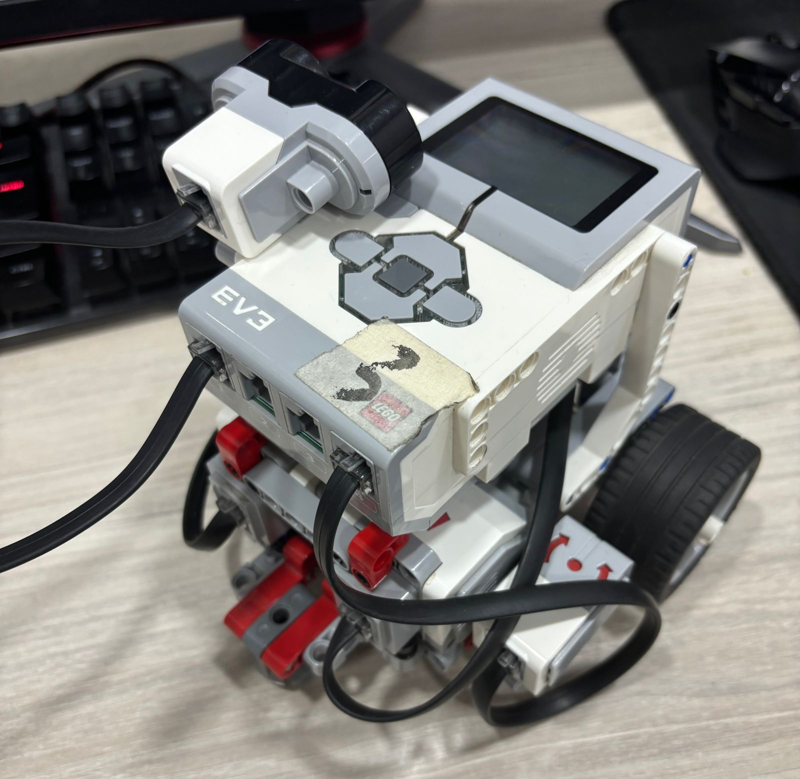

# EV3 First impression

<!--
TODO:
Presentación de los Robots: Descripción detallada de los robots EV3incluyendo sus carac-
terísticas físicas y capacidades
-->

## ¿Qué es Lego EV3?

El EV3 es un robot programable parte de la serie LEGO Mindstorms. Esta serie combina piezas de LEGO con componentes electrónicos avanzados para crear robots interactivos y programables. El modelo EV3 es conocido por su versatilidad y capacidad de ser configurado en una amplia variedad de formas y funciones.

## Descripción Física

El robot está construido principalmente con piezas de LEGO, lo que le proporciona una estructura robusta y modular. Esto permite personalizar y modificar el robot fácilmente. Los componentes principales del EV3 incluyen:

* Brick EV3: Es el cerebro del robot, un bloque programable que contiene el procesador y la memoria, y sirve como la unidad central de control.
* Motores: Dos motores en los laterales para el control de ruedas. Pero tiene disponibilidad de conectar hasta 4 motores.
* Ruedas y Estructura: Las ruedas permiten la movilidad, y la estructura construida con piezas Technic ofrece soporte y estabilidad al robot.

## Descripción de sus Partes

### Brick EV3

* Pantalla: Muestra información de la programación y el estado del robot.
* Puertos de Conexión: Para conectar sensores y motores. Tiene puertos numerados de 1 a 4 para sensores y de A a D para motores.
* Botones de Control: Para navegar por el menú y seleccionar opciones.
* Altavoz: Permite la salida de sonidos programados.

### Motores

* Motores Grandes: Ofrecen alta potencia y son ideales para mover el robot.
* Motor Mediano: Menos potente pero más rápido, utilizado para tareas que requieren velocidad en lugar de fuerza.

### Sensores

* Sensor de Color: Detecta colores y mide la intensidad de la luz. Puede ser utilizado para seguir líneas o distinguir colores en el entorno.
* Sensor Ultrasónico: Mide la distancia a objetos, lo que permite al robot detectar y evitar obstáculos.
* Sensor de Toque: Detecta presión, lo que puede ser utilizado para iniciar o detener acciones.
* Giroscopio: Mide la orientación y el movimiento angular, útil para mantener el equilibrio y controlar giros precisos.

### Capacidades Técnicas

* Programabilidad: Puede ser programado usando el software EV3-G, que proporciona una interfaz gráfica de programación basada en bloques, así como otros lenguajes de programación como Python o C++.

* Conectividad: Ofrece opciones de conectividad Bluetooth, WiFi y USB para cargar programas y comunicarse con otros dispositivos.
  
* Memoria: Tiene memoria interna y soporte para tarjetas microSD, permitiendo el almacenamiento de programas complejos y grandes cantidades de datos.

* Sensores y Actuadores: La capacidad de integrar múltiples sensores y actuadores permite al EV3 realizar tareas complejas y reactivas, como seguir líneas, evitar obstáculos, detectar colores y más.

