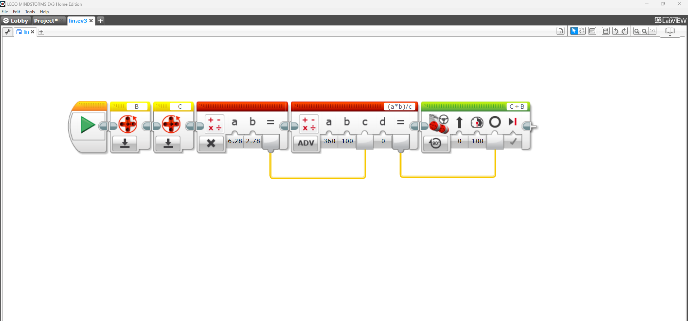
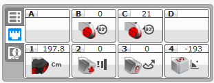

# Propietary development enviroments
<!--

Herramientas de desarrollo propias: Demostración de las herramientas de desarrollo propias de los
robots, destacando su utilidad y funcionalidades. (Si es posible). Resumir las herramientas propias
que disponen los robots para facilitar la programación y el control.
-->

Lego provee una herramienta de programación por bloques llamada LEGO MINDSTORM. Su primera versión estaba basada en LABVIEW, mientras que la segunda (y ultima versión) se programa usando Scratch.

Estos IDEs proporcionan herramientas para controlar:

* Motores: Velocidad, rotación, dirección, frenos.
* Display: Textos e imágenes.
* Bocinas: Reproducción de sonidos.
* Botones del brick: Para ejecutar acciones al ser presionados.

Tambien cuenta con herramientas para la medición de los distintos sensores:

* Pulsador: Presionado o libre.
* Ultrasonido: Distancia.
* Encoders: Ángulo y rotaciones.
* Infrarrojo
* Giroscopio: Medición de angulo y velocidad angular.
* Detector de color

  
El IDE también incluye funciones lógicas como bucles for, condicionales if/else, timers, time outs, operaciones matemáticas, generador de números aleatorios, entre otros.
